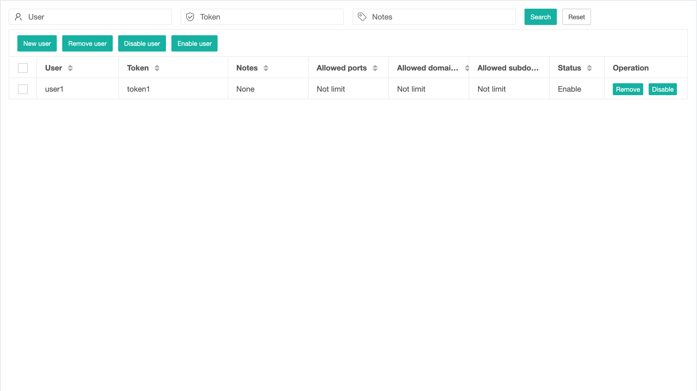
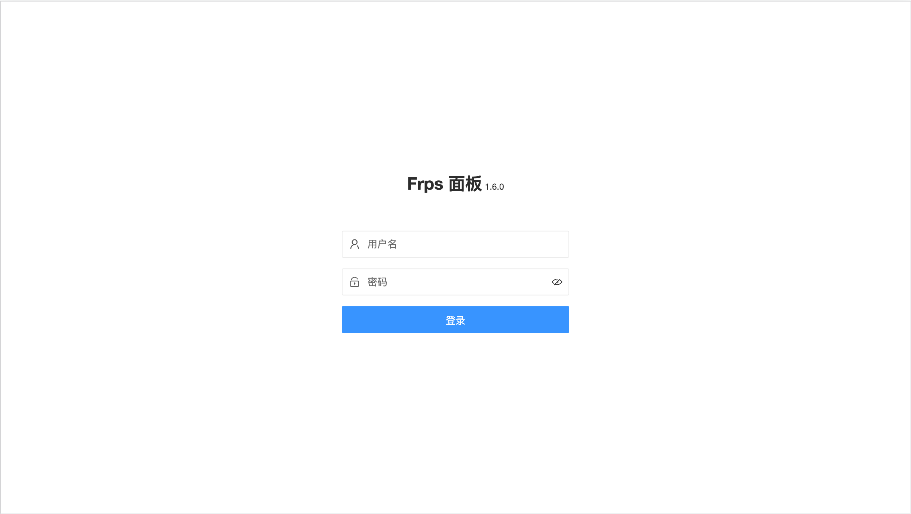

# frps-panel(Support FRP 0.51.3)

[README](README.md) | [中文文档](README_zh.md)

frp server plugin to show server info and support multiple users for [frp](https://github.com/fatedier/frp).

frps-panel will run as one single process and accept HTTP requests from frps.





### Features

+ **Show frp server info**
+ **Support multiple user authentication by tokens saved in file.**
+ **Dynamic `add`,`remove`,`disable` or `enable` user now**
+ **Limit `ports`,`domains` and `subdomains` for each user now**

***when a user is dynamic been `remove` or `disable`,it will take some time to be effective***

***the limit of `ports`、`domains`、`subdomains` only effective at `NewProxy`***

### Download

Download frps-panel binary file from [Release](../../releases).

### Requirements

frp version >= v0.31.0

### Usage

1. Create file `frps-panel.toml` including common config.

```toml
#frps-panel.toml
[common]
# frps panel config info
plugin_addr = "127.0.0.1"
plugin_port = 7200
#admin_user = "admin"
#admin_pwd = "admin"
# specified login state keep time
admin_keep_time = 0

# enable tls
tls_mode = false
# tls_cert_file = "cert.crt"
# tls_key_file = "cert.key"

# frp dashboard info
dashboard_addr = "127.0.0.1"
dashboard_port = 7500
dashboard_user = "admin"
dashboard_pwd = "admin"
```

2. Create file `frps-tokens.toml` to save users,it should be the same place with `frps-panel.toml`.this file will auto create by system.

```toml
#frps-tokens.toml
[tokens]
   [tokens.user1]
      user = "user1"
      token = "token1"
      comment = "user1 with token1"
      ports = [8080, "10000-10200"]
      domains = ["web01.domain.com", "web02.domain.com"]
      subdomains = ["web01", "web02"]
      enable = true
   [tokens.user2]
      user = "user2"
      token = "token2"
      comment = "user2 with token2"
      ports = [9080]
      domains = ["web11.domain.com", "web12.domain.com"]
      subdomains = ["web11", "web12"]
      enable = false
```


3. Run frps-panel:

   `./frps-panel -c ./frps-panel.toml`

4. Register plugin in frps.

```ini
# frps.ini
[common]
bind_port = 7000

[plugin.multiuser]
; if you set tls_mode = true, you should change addr value to https://127.0.0.1:7200
addr = 127.0.0.1:7200
path = /handler
ops = Login,NewWorkConn,NewUserConn,NewProxy,Ping
```

5. Specify username and meta_token in frpc configure file.

   For user1:

```ini
# frpc.ini
[common]
server_addr = x.x.x.x
server_port = 7000
user = user1
meta_token = 123

[ssh]
type = tcp
local_port = 22
remote_port = 8080
```

   For user2:(user2 cannot connect to server,because it is disabled)

```ini
# frpc.ini
[common]
server_addr = x.x.x.x
server_port = 7000
user = user2
meta_token = abc

[ssh]
type = tcp
local_port = 22
remote_port = 6000
```

6. Manage your users in browser via: http://127.0.0.1:7200 or https://127.0.0.1:7200

## Run as service

this example is for `ubuntu` and with `root` user

+ 1.unzip `frps-panel.zip` to dir `/root/frps-panel`
+ 2.touch a file with command `touch frps-panel.service` in dir `/root/frps-panel`.the file content is:
```ini
[Unit]
Description = frp multiuser service
After = network.target syslog.target
Wants = network.target

[Service]
Type = simple
# config of frps-panel.toml,you should change the file path
Environment=FRPS_PANEL_OPTS="-c /root/frps-panel/frps-panel.toml"
# command of run frps-panel,you should change the file path
ExecStart = /root/frps-panel/frps-panel $FRPS_PANEL_OPTS

[Install]
WantedBy = multi-user.target
```
+ 3.copy `frps-panel.service` to `/etc/systemd/system/` with command `cp /root/frps-panel.service /etc/systemd/system/`
+ 4.reload service with command `systemctl daemon-reload`
+ 5.start service with command `service frps-panel start`

## Issues & Ideas

___If you want visit mange ui from internet, you should change `plugin_addr` to `0.0.0.0`___

If you have any issues or ideas, put it on [issues](https://github.com/yhl452493373/frps-panel/issues). I will try my best to achieve it.

## Credits

+ [frp](https://github.com/fatedier/frp)
+ [fp-multiuser](https://github.com/gofrp/fp-multiuser)
+ [layui](https://github.com/layui/layui)
+ [layui-theme-dark](https://github.com/Sight-wcg/layui-theme-dark)
+ [echarts](https://github.com/apache/echarts)
